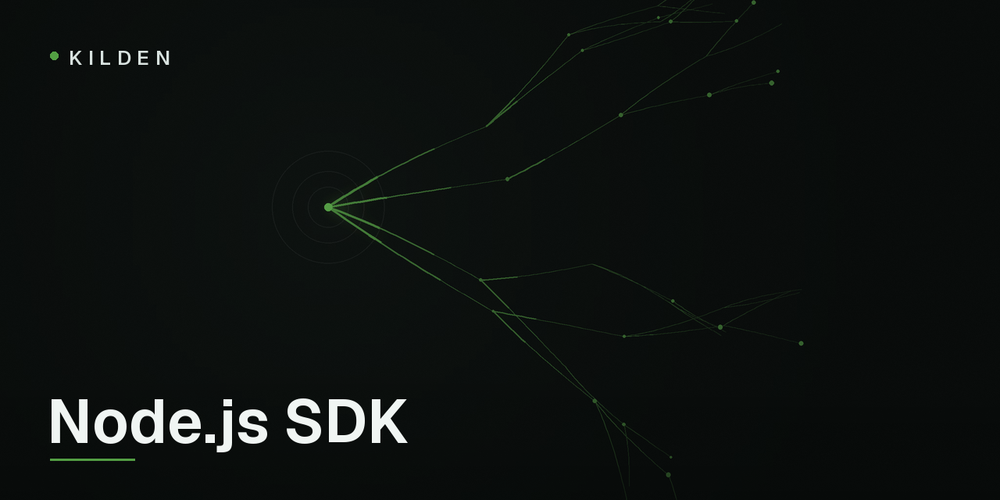

<p align="center">
  
</p>

# @kilden-io/node

[](https://www.npmjs.com/package/@kilden-io/node)
[](https://github.com/kildenhq/kilden-sdk-node/actions/workflows/ci.yml)
[](LICENSE)

[Kilden](https://kilden.io) is a customer data platform — product analytics,
campaigns and session replay on one event pipeline. This is the **server-side**
Node.js SDK: events your backend can vouch for, identity-token signing, and
feature flags. Zero runtime dependencies, Node ≥ 18.

For the browser, use the web SDK
([kilden-sdk-js](https://github.com/freshworkstudio/kilden-sdk-js)) — it owns
sessions, autocapture and replay. This package is for code you run.

## Install

```sh
npm install @kilden-io/node
```

## First event

```ts
import { Client } from "@kilden-io/node";

const kilden = new Client(process.env.KILDEN_SECRET_KEY);

kilden.track("user_42", "order_completed", { revenue: 99.9, currency: "CLP" });

await kilden.close(); // on shutdown — see Batching below
```

Use the project's **secret** key (`sk_…`), never the public one. Events sent
with the secret key are `source=server` and `verified=true` on the platform:
facts, fit for revenue and campaign triggers. The constructor rejects public
keys outright. Keep the secret key out of browsers, mobile apps, and anything
you ship to users.

## Identity verification

Anyone can open a browser console and send events as `ceo@yourcompany.com` —
unless you turn on identity verification. Your backend signs a short-lived
token for the user it authenticated; the browser SDK attaches it; the platform
marks those events verified. `IdentitySigner` is the whole integration:

```ts
import { IdentitySigner } from "@kilden-io/node";

const signer = new IdentitySigner(process.env.KILDEN_IDENTITY_SECRET, { kid: "k1" });

// e.g. an Express endpoint the web SDK polls for a fresh token
app.post("/kilden/identity", (req, res) => {
  const user = req.user; // your auth middleware
  res.json({
    distinct_id: String(user.id),
    token: signer.sign(String(user.id), { traits: { plan: user.plan } }),
  });
});
```

**Only sign a `sub` your backend authenticated.** Something like
`signer.sign(req.body.user_id)` lets anyone impersonate anyone — with a
"verified" stamp on top. Signed `traits` override unsigned ones during
enrichment. Tokens default to a 1-hour TTL, capped at 7 days.

`IdentitySigner` is a separate class on purpose: a controller that renders a
page wants a token, not an event queue.

## Events

```ts
kilden.track(distinctId, event, properties?, { timestamp?, uuid? });
kilden.identify(distinctId, traits?);          // upsert person traits
kilden.alias(previousId, distinctId);          // attach a new id to an existing person
```

`distinct_id` is explicit on every call — the SDK holds no identity state.
Pass `uuid` when you retry your own jobs: events deduplicate by UUID, so
replays are idempotent. Pass `timestamp` (ISO 8601 or `Date`) when importing
historical data.

## Feature flags

```ts
if (await kilden.isEnabled("new_checkout", "user_42", {
  personProperties: { plan: "pro" },  // evaluation-time overrides
  default: false,                     // returned if Kilden can't answer
})) {
  // ...
}

const variant = await kilden.getFeatureFlag("exp_button", "user_42"); // false | true | "variant_key"
```

Evaluation is remote with a 30-second in-memory cache per `distinct_id`; a
lookup that fails (timeout, network) returns `default` and never throws.
Calls with `personProperties` bypass the cache.

## Batching and shutdown

Events queue in memory and flush every 10 seconds or 20 events (configurable).
The flush timer is `unref()`d so it never keeps your process alive — which
also means **exiting without `close()` loses whatever is still queued**. A
best-effort `beforeExit` hook narrows the window but cannot catch `SIGKILL`
or `process.exit()`:

```ts
await kilden.close(); // final flush with a 10s deadline, then stops the worker
```

The queue is bounded (`maxQueueSize`, default 10 000): beyond it the newest
event is dropped and `kilden.dropped` counts it. Delivery retries 429/5xx/
network errors three times with exponential backoff and honors `Retry-After`.
The API never throws after construction — invalid input is dropped and logged
instead of taking your request down.

## Options

```ts
new Client(secretKey, {
  host: "https://ingest.kilden.io",
  flushAt: 20,          // events that trigger a flush
  flushInterval: 10,    // seconds
  maxQueueSize: 10000,
  timeout: 3,           // seconds per request
  transport: null,      // bring your own (implements Transport)
  debug: false,
  enabled: true,        // false = every call is a no-op (tests, CI)
});
```

## Spec

This SDK implements
[kilden-sdk-spec](https://github.com/kildenhq/kilden-sdk-spec) v0.1 —
one spec and one frozen vector set shared by the PHP, Node, Python, Ruby and
Go SDKs, enforced in CI against the spec's mock capture server. Behavior
changes land in the spec first; see
[CONTRIBUTING.md](CONTRIBUTING.md).

## Community

Questions and design conversations:
[Discussions](https://github.com/kildenhq/kilden-sdk-node/discussions).
Product docs: [kilden.io/docs](https://kilden.io/docs).

## License

[MIT](LICENSE)
